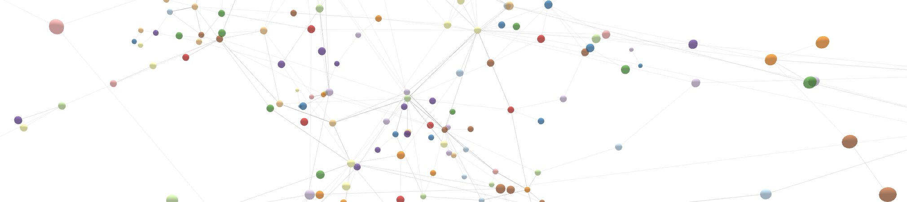

# github-collaboration-network
Using GitHub's API to find social connections in pull requests and issues comments. Social network connections are between the author of the pull request/issue and the author of the comments.



## Example of Social Network

**Author:**
Person_1

**Comment Authors:**
Person_2, Person_3, Person_4

**Social Connections:**
((Person_1, Person_2), (Person_1, Person_3), (Person_1, Person_4))

## Running the Code in the Terminal

1 - Clone the repository.

```bash
git clone git@github.com:tmickleydoyle/github-collaboration-network.git
```

or

```bash
git clone https://github.com/tmickleydoyle/github-collaboration-network.git
```

2 - Move into the repository directory.

```bash
cd github-collaboration-network
```

3 - Execute the Makefile

```bash
make
```

*******

The following information is needed to run the scripts and can be located on the `file_manager.py` file:

```bash
GITHUB_USERNAME = os.environ['GITHUB_USERNAME']
GITHUB_TOKEN = os.environ['GITHUB_TOKEN']
ORGANIZATION = os.environ['GITHUB_ORGANIZATION']
```

GITHUB_USERNAME - GitHub profile name/login.

GITHUB_TOKEN - Token linked to an individual account. [Step for creating a token.](https://help.github.com/en/github/authenticating-to-github/creating-a-personal-access-token-for-the-command-line)

ORGANIZATION - The name of the organization. This only works for organizations the user has is an active member.

I have included the above information in my `bash_profile`.

*******

I am adding a Bernoulli Mixture Model to find the most likely people to include in a social group.

TODO:
- Build a mapping from the model output to GitHub logins.
- Sort output to include top _n_ users.

*******

Author: [Thomas Mickley-Doyle](https://github.com/tmickleydoyle)

Developed on Macbook Pro 2018
